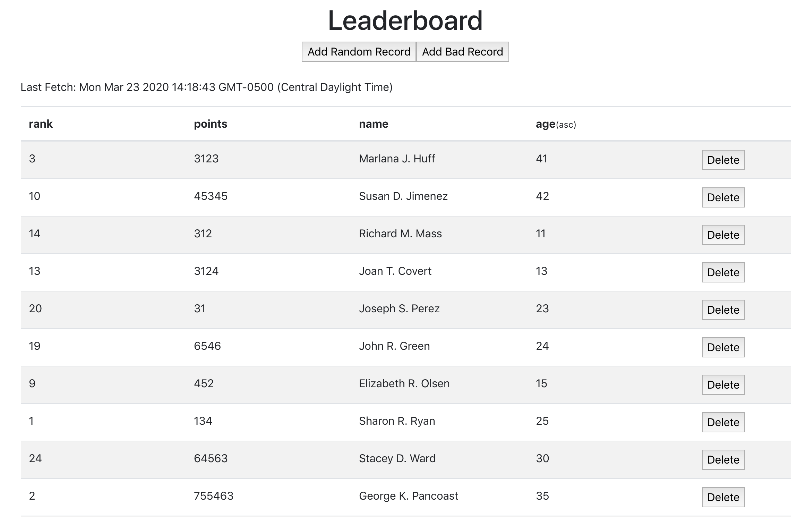

## RED Node Exercise

The goal of this exercise is to create a table of sortable data by building out all of the server side functionality and making the necessary connections between the server and the client. See the [README](server/README.md) for the complete list of server "to dos". 

The majority of the UI has been completed except for connecting the client side API. See the [README](client/README.md) for the complete list of client "to dos".

*************************

## From Root Directory

### Install NPM Packages
- npm install
  - should automatically run postinstall script for nested package.json files
  - if not, cd into both client and server directories to run npm install on each, then return to root directory
  - if node_modules directories do not display, close window and reopen

### Start Server
- npm run startdev (for nodemon)
 **or** 
- npm start (for node)

### Seed Database
- npm run seed

### View in Browser
- [Localhost](http://localhost:50000)

### Build
- bundle.js is already built
- to rebuild after changes, run the following from the root directory:
  - npm run build
- webpack is already configured to watch for changes

### Test
- npm run test
